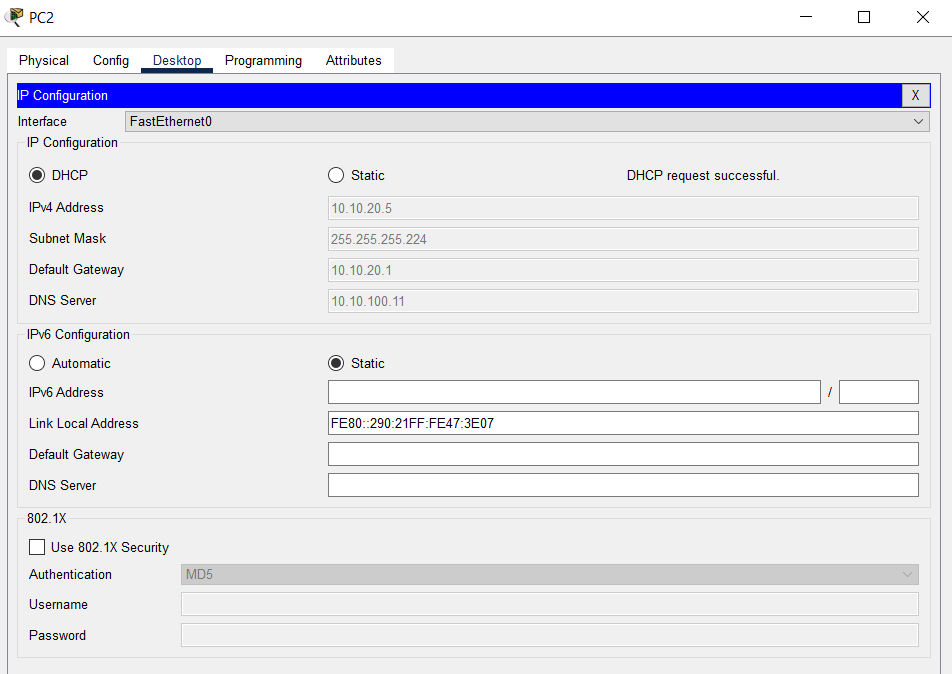
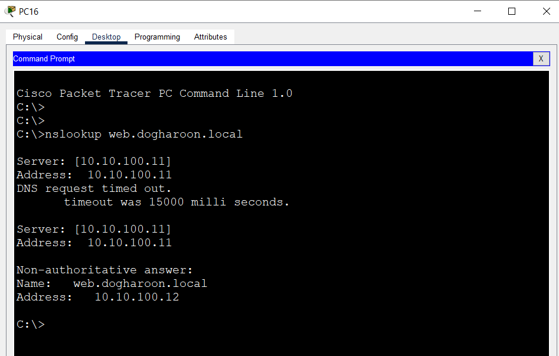
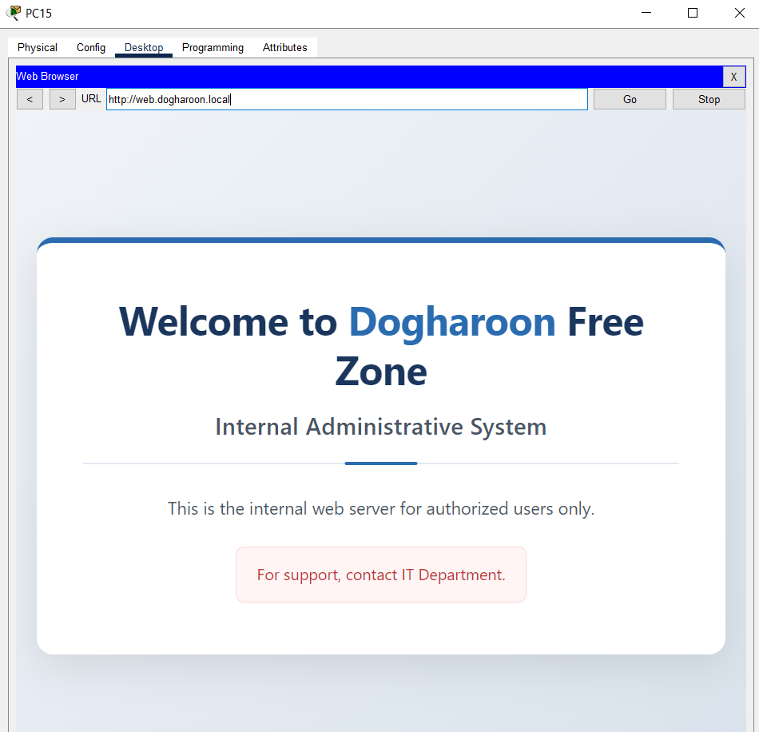
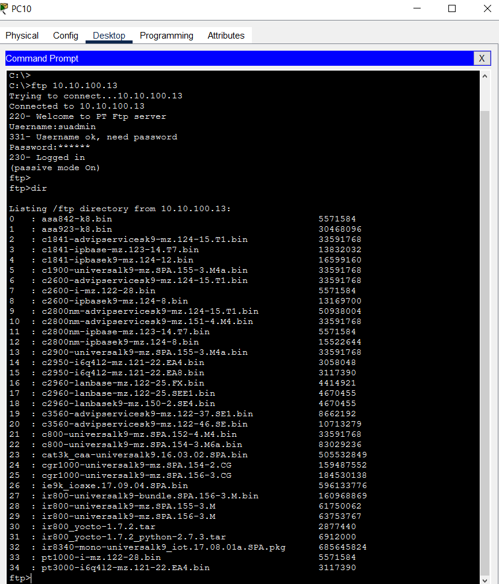
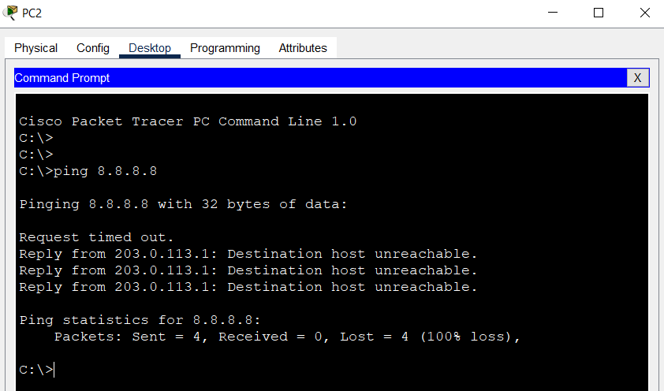
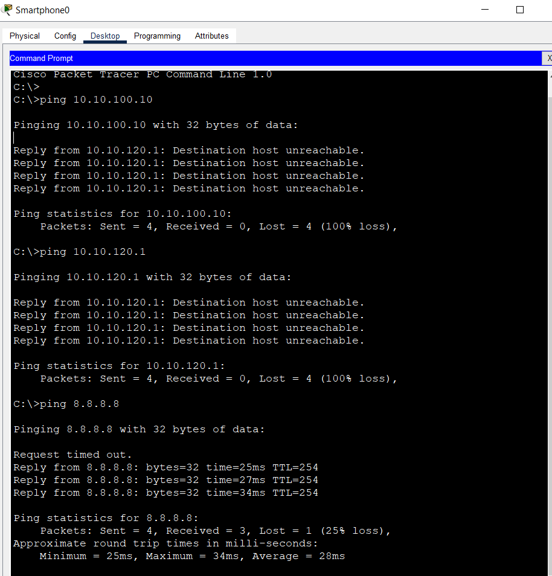
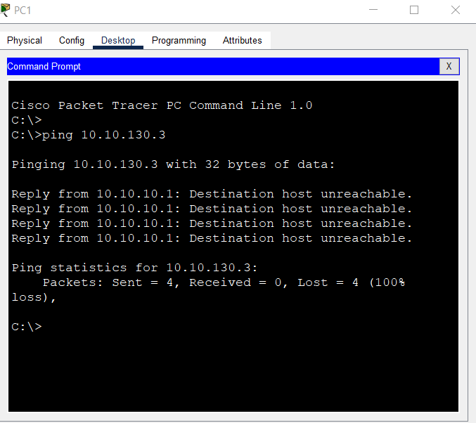
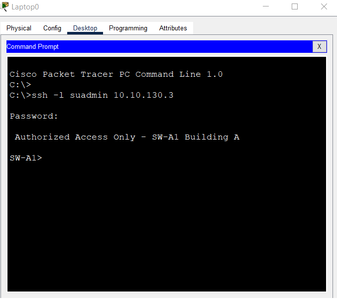
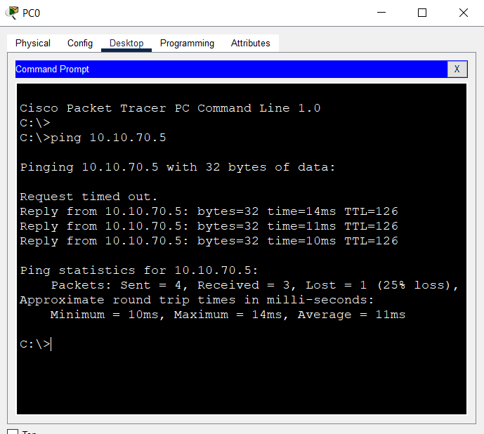
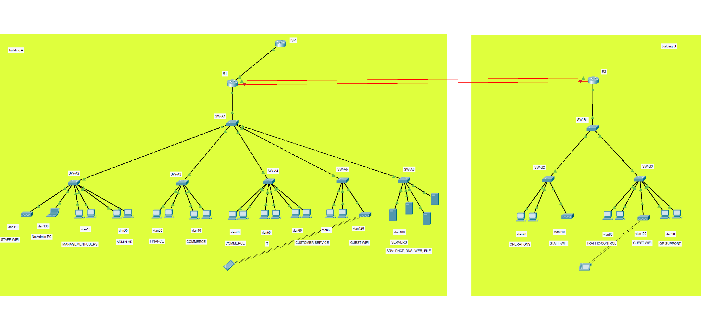

# Test Screenshots

## 1. DHCP Success

## 2. DNS Resolution

## 3. Web Server

## 4. FTP Server

## 5. Internet Access

## 6. ACL Guest Isolation

## 7. ACL Block Management

## 8. SSH Management

## 9. Inter-Building Ping

## 10. Topology Final

